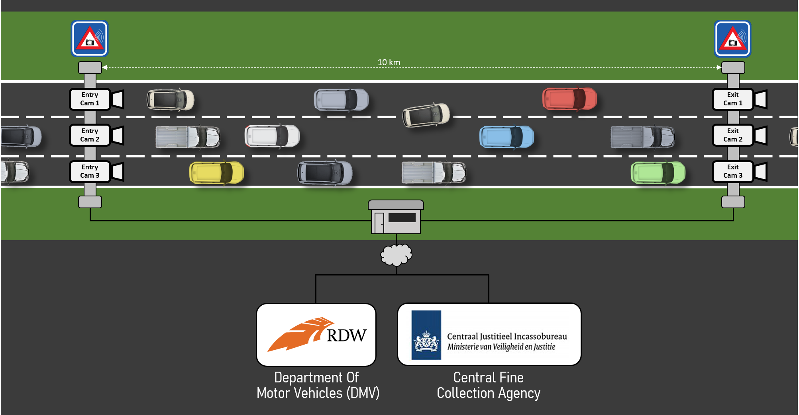
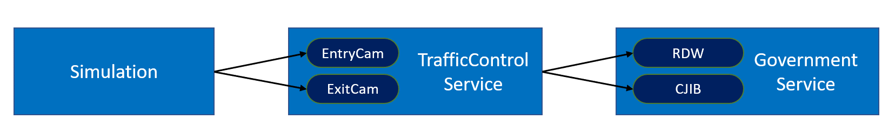
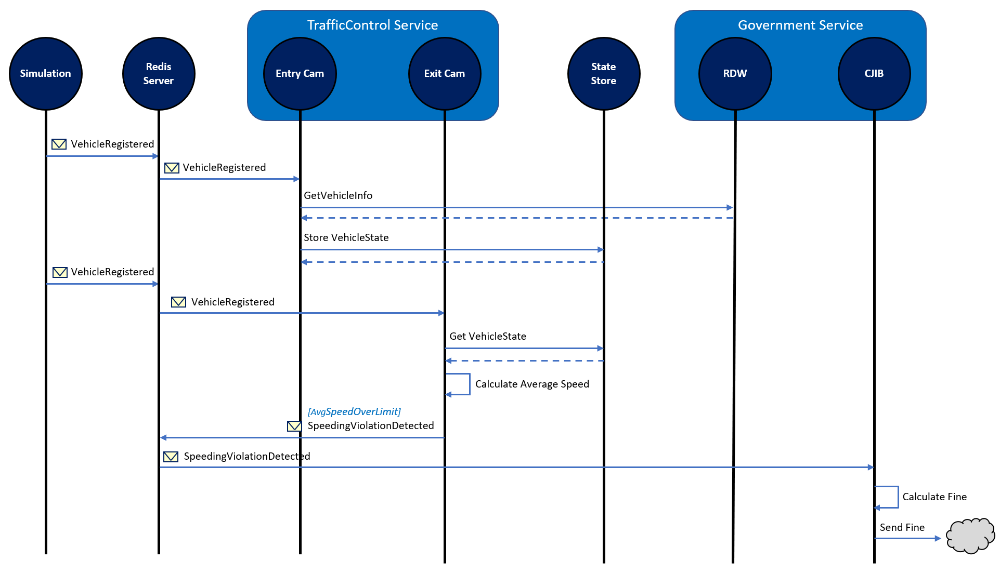
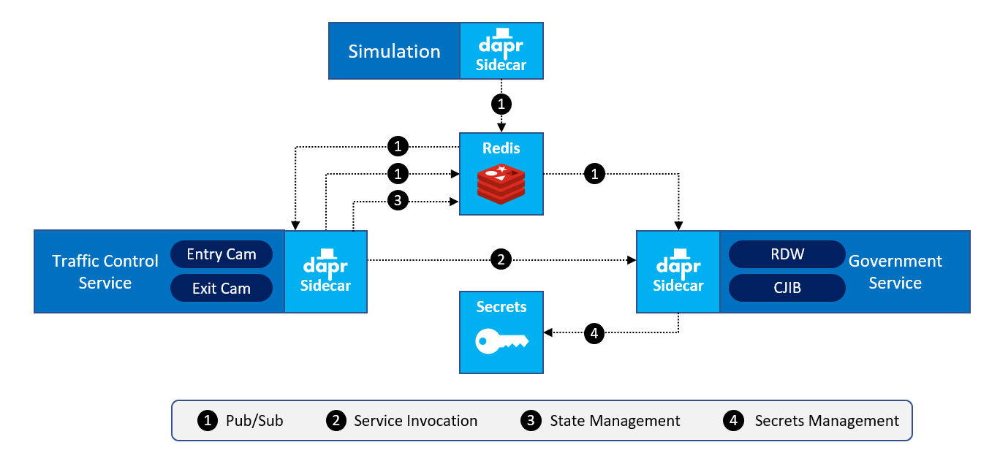

# Dapr 动手实验

此存储库包含多个动手实验，这些作业将向您介绍 Dapr。您将从一个包含多个服务简单的ASP.NET Core应用程序开始。在每个实验中，您将更改应用程序的一部分，以便它与 Dapr 一起使用（或像多诺万·布朗说的"rub some Dapr on it"）。您将使用 Dapr 功能包括： 

- Service invocation 服务调用
- State-management 状态管理
- Publish / Subscribe 发布/订阅
- Secrets 机密信息

对于实验，我们将在独立模式下使用 Dapr。作为扩展目标，我们添加了最后一个实验，该任务将要求您在 Kubernetes 上运行 Dapr 应用程序。

## 领域问题

对于作业，我们将使用超速摄像头装置，该装置可在多个荷兰高速公路上找到。在某条高速公路的整个长度上，将测量车辆的平均速度，如果该平均速度高于该高速公路上的超速极限，则该车辆的驾驶员会收到超速罚单。

### 概览

这是您要模拟的虚拟设置的概述:



每个泳道有1个进入相机和1个离开相机。当汽车通过入口摄像机时，将注册该汽车的车牌号。

在后台，通过调用汽车部门的Dvd服务（DMV（或荷兰语中的RDW））获取有关车辆的信息。

当汽车通过出口摄像机时，系统会对其进行记录。然后，系统根据进出时间戳记计算汽车的平均速度。如果检测到超速违规，则会向中央司法征收机构发送一条消息-CJCA（或荷兰语中的CJIB）会将超速罚单发送给车辆驾驶员。


### 架构

为了在代码中进行模拟，可以使用以下服务：



-  **Simulation** 是一个 .NET Core 控制台程序模拟过路车.
-  **TrafficControlService** 是一个ASP.NET Core的WebAPI的应用程序，提供2个端点: *Entrycam* 和 *ExitCam*.
-  **Government** 服务是一个ASP.NET Core的WebAPI的应用程序，提供2个端点：*RDW*（检索车辆信息）和*CJIB*（用于发送超速罚单） 

下面的序列图描述了仿真的工作方式：



1.  **Simulation** 模拟生成汽车车牌号并发送一个消息 *VehicleRegistered*  (包含汽车车牌号, 一个随机的泳道 (1-3) 和时间戳) 到服务 **TrafficControlService** 的端点 *EntryCam* .
2.  **TrafficControlService** 调用 **GovernmentService** 服务的 *RDW* 的端点  检索对应的汽车号牌车辆的品牌和型号
3.  **TrafficControlService** 在 state-store 里 存储VehicleState (车辆信息和进入时间戳) .
4. 一些随机间隔之后，  **Simulation** 发送 *VehicleRegistered* 消息到 **TrafficControlService** 服务的端点  *ExitCam* (含有在步骤1中产生的汽车号牌，随机出口车道（1-3）和出口时间戳).
5.  **TrafficControlService** 从state-store中获取 VehicleState .
6.  **TrafficControlService**使用 进入和出去的时间戳 计算平均速度.
7.  如果平均速度高于速度极限时,  **TrafficControlService** 将发送 *SpeedingViolationDetected* 消息 (包含车辆的车票，路面的标识符，高速化违反KMH和违规的时间戳) 到  **GovernmentService** 的端点 *CJIB* .
8.  **GovernmentService** 计算超速违章罚款和模拟发送超速票给车主

在执行过程中，此序列中描述的所有操作都会记录到控制台，因此您可以按照流程进行操作。

### 结束

完成所有任务后，架构已更改为可与Dapr配合使用。为了传递消息，使用了**发布和订阅构件**。为了与服务进行请求/响应类型的通信，使用了**服务 到服务的调用**构造块。为了存储车辆的状态，使用 **状态管理** 模块。




在我们的实验中，使用Redis组件用于状态管理以及发布/订阅.

## 入门

### 先决条件

确保在计算机上安装以下先决条件：

- .NET Core 3.1 ([download](https://dotnet.microsoft.com/download/dotnet-core/3.1))
- Visual Studio Code ([download](https://code.visualstudio.com/download))
- Docker for desktop ([download]())
- Dapr CLI 1.0.0 RC3 ([download](https://github.com/dapr/cli/releases/tag/v1.0.0-rc.2))
- Dapr Runtime 1.0.0 RC3

### 安装 Dapr

如果尚未在计算机上独立安装Dapr，请首先执行此操作。如果已安装，则可以跳过此步骤。

1. 确保已安装所有先决条件，并且计算机上运行Docker-Desktop

2. 打开一个新的命令行窗口。

3. 输入以下命令:

   ```
   dapr init --runtime-version 1.0.0-rc.3
   ```

4. 检查日志记录中是否有错误

### 使用说明

每个实验都包含在此存储库中的单独文件夹中。每个文件夹都包含您可以遵循的作业的描述。该文件夹还包含应用程序的起点，就像先前的实验已正确执行一样。

作业的每个描述（接受第一个描述）都包含两个部分，每个部分都有执行作业的某种特定方法：**DIY** 部分和**step-by-step** 部分。DIY部分仅说明您需要实现的结果，而没有进一步的说明。在Dapr文档的帮助下，完全取决于您要实现目标。分步部分准确地描述了您需要逐步更改应用程序中的内容。由您选择一种方法。如果您选择DIY方法并陷入困境，则可以随时寻求逐步方法的帮助。

现在是时候让您开始动手做，并开始第一个任务了：

1. 克隆Github的仓库到你本地机器文件夹:

   ```
   git clone https://github.com/NanoFabricFX/dapr-hands-on.git
   ```

2. 跳转到 [作业 1](Assignment01/README.md).
